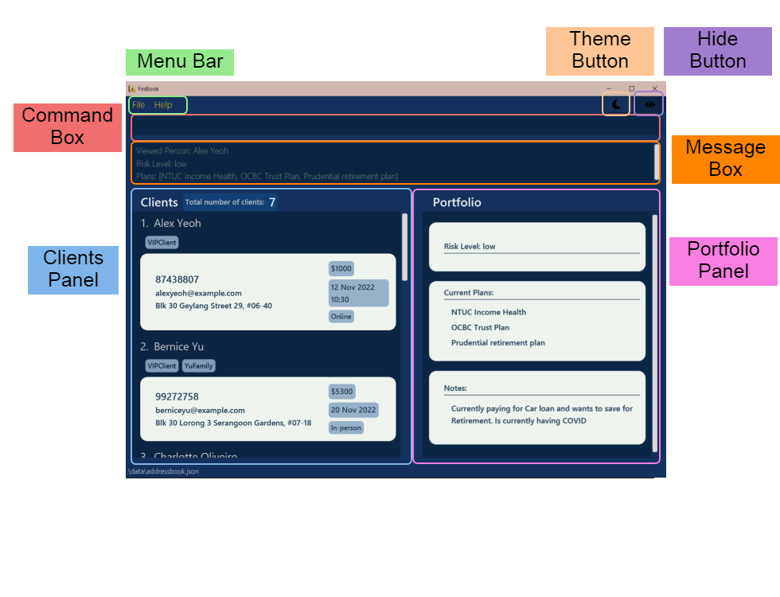
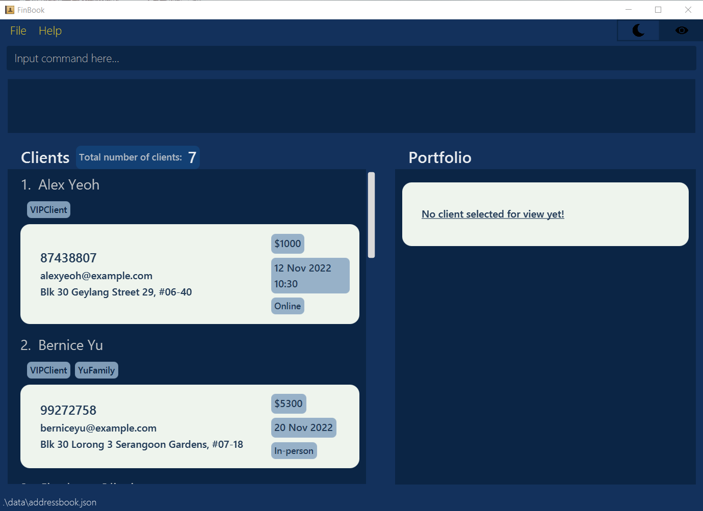
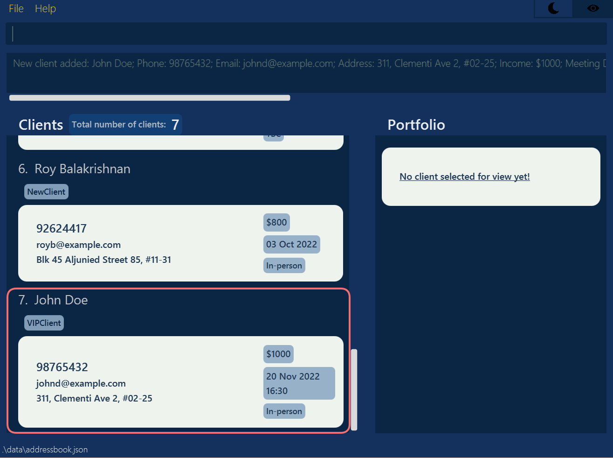
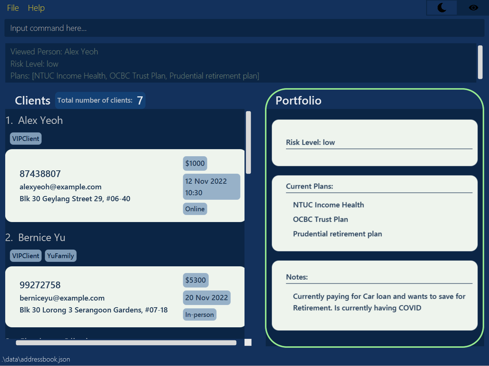
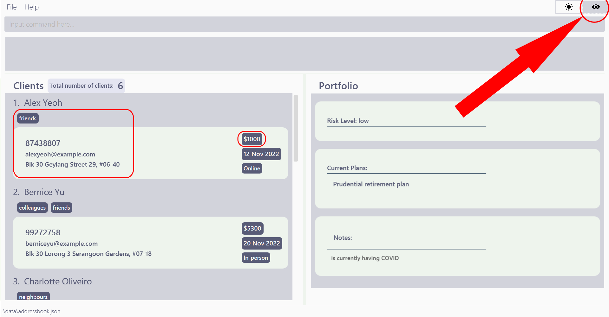
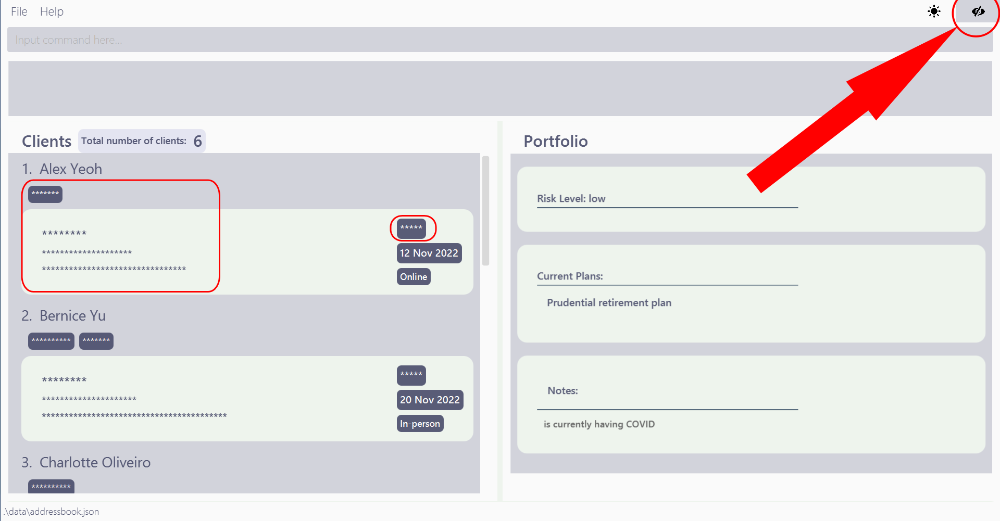
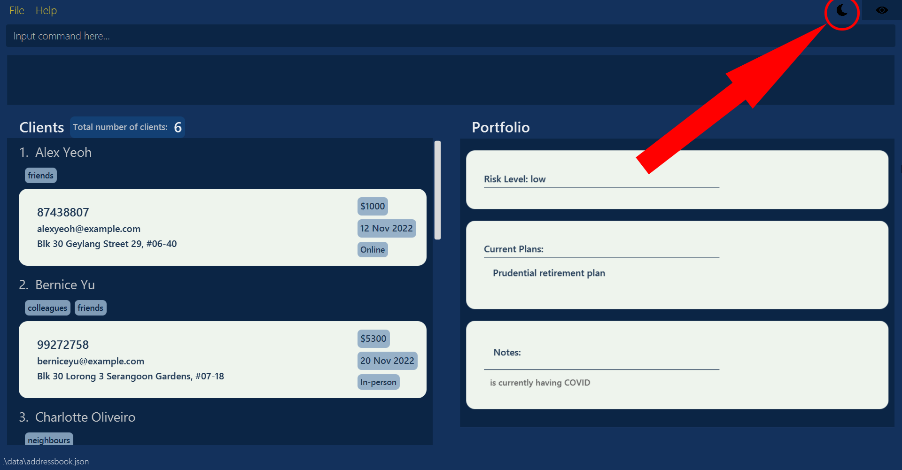

# Table of Contents

1. [Introduction](#1-introduction)<br>
   1.1. [What is FinBook?](#11-what-is-finbook)<br>
2. [How to use this User Guide?](#2-how-to-use-this-user-guide)<br>
   2.1. [Icons and symbols](#21-icons-and-symbols)<br>
   2.2. [User Interface (UI) of FinBook](#22-user-interface-ui-of-finbook)<br>
   2.3. [Command format](#23-command-format)<br>
3. [Quick Start](#3-quick-start)<br>
4. [Features](#4-features)<br>
   4.1. [Managing a client](#41-managing-a-client)<br>
   &emsp; 4.1.1. [Adding a client: `add`](#411-adding-a-client-add)<br>
   &emsp; 4.1.2. [Editing a client: `edit`](#412-editing-a-client--edit)<br>
   &emsp; 4.1.3. [Deleting a client: `delete`](#413-deleting-a-client--delete)<br>
   &emsp; &emsp; 4.1.3.1. [Deleting a single client](#4131-deleting-a-single-client)<br>
   &emsp; &emsp; 4.1.3.2. [Deleting multiple clients](#4132-deleting-multiple-clients)<br>
   &emsp; 4.1.4. [Listing all clients: `list`](#414-listing-all-clients--list)<br>
   &emsp; 4.1.5. [Finding a client: `find`](#415-finding-a-client--find)<br>
   &emsp; 4.1.6. [Viewing Portfolio of a specific client: `view`](#416-viewing-portfolio-of-a-specific-client-view)<br>
   4.2. [Data privacy](#42-data-privacy)<br>
   &emsp; 4.2.1. [Locking the application: `lock`](#421-locking-the-application--lock)<br>
   &emsp; 4.2.2. [Setting or updating the password: `password`](#422-setting-or-updating-the-password--password)<br>
   &emsp; 4.2.3. [Resetting the password](#423-resetting-the-password)<br>
   &emsp; 4.2.4. [Hiding sensitive data](#424-hiding-sensitive-data)<br>
   4.3. [General](#43-general)<br>
   &emsp; 4.3.1. [Saving the data](#431-saving-the-data)<br>
   &emsp; 4.3.2. [Editing the data file](#432-editing-the-data-file)<br>
   &emsp; 4.3.3. [Importing data: `import`](#433-importing-data--import)<br>
   &emsp; 4.3.4. [Exporting data: `export`](#434-exporting-data--export)<br>
   &emsp; 4.3.5. [Copying a client's data: `copy`](#435-copying-a-clients-data--copy)<br>
   &emsp; 4.3.6. [Sorting clients: `sort`](#436-sorting-clients--sort)<br>
   &emsp; 4.3.7. [Changing Light/Dark mode](#437-changing-lightdark-mode)<br>
   &emsp; 4.3.8. [Exiting the application: `exit`](#438-exiting-the-application--exit)<br>
5. [FAQ](#5-faq)<br>
6. [Glossary](#6-glossary)<br>
7. [Command Summary](#7-command-summary)<br>

--------------------------------------------------------------------------------------------------------------------

# 1. Introduction

## 1.1. What is FinBook?

**FinBook is a desktop application for you as a Financial Advisor (FA) to manage your client details and ensure that
your data is secured.** With FinBook, you can set a unique [password](#422-setting-or-updating-the-password--password),
[manage](#41-managing-a-client) and [view](#416-viewing-portfolio-of-a-specific-client-view) client’s details,
meetings and portfolio as well as many [other features](#43-general) to make your daily workflow much
**more efficient**!

FinBook is optimized for use via a **Command Line Interface (CLI)**, which means most of our commands are done by typing.
If you can type fast, managing your clients will be a breeze with FinBook. Can’t type fast? Don’t worry!
Our Graphical User Interface (GUI) will help you slowly adjust to using our CLI.

So what are you waiting for? Start using FinBook.

[⬆ back to Table of Contents](#table-of-contents)

---

# 2. How to Use this User Guide?

1. To get familiar with this user guide you can continue reading, [How to Use this User Guide](#2-how-to-use-this-user-guide).
2. If you are a new user, you can get started with [Quick Start](#3-quick-start) to familiarise yourself with FinBook.
3. If you are familiar with FinBook, you can refer to the [Features](#4-features) to see details of all available
   commands or refer at [Command Summary](#7-command-summary).

[⬆ back to Table of Contents](#table-of-contents)

---

## 2.1. Icons and symbols

| Symbol               | Meaning                                                                                    |
|----------------------|--------------------------------------------------------------------------------------------|
| :information_source: | Additional information that may be useful to know when using FinBook                       |
| :exclamation:        | Important information or warnings that you should take note of when using FinBook          | 
| `command`            | The highlighted words indicate a command that can be typed into the Command Box of FinBook |

[⬆ back to Table of Contents](#table-of-contents)

---

## 2.2. User Interface (UI) of FinBook



The UI consists of:

| Components     | Purpose                                |
|----------------|----------------------------------------|
| Menu Bar       | Consists of File and Help              |
| Theme Button   | To toggle between Light/Dark mode      | 
| Hide Button    | To toggle between hide and unhide mode | 
| Command Box    | To enter commands to be executed       |
| Message Box    | Display results of executed command    |
| Clients Panel  | Displays clients of FinBook            |
| Portfolio View | Displays portfolio of selected client  |

[⬆ back to Table of Contents](#table-of-contents)

---

## 2.3. Command format

Commands in FinBook are constructed using a command word. Most commands consist of a command word, prefixes
and parameters

For example,


1. **Command word**: Indicates what action you want FinBook to do. For this example, the command word `add` will add
   a client into FinBook
2. **Prefix**: To specify the field of data added. Each prefix always ends with a `/`. For this example, `n/` indicates
   the
   client's name, `p/` indicates the client's phone number, etc.
3. **Parameter**: Provides supplementary information to the command word or prefix. For this example, `John Doe` is the
   parameter for `NAME`

### Prefix Table

| Prefix | Corresponding Parameter                  | Description                                                                                                                                                                                                                                                                                                                                                                                                                                                                                                                                                                                                                                                                                                                                                                                                         | Examples                                                                                                                                      |
|--------|------------------------------------------|---------------------------------------------------------------------------------------------------------------------------------------------------------------------------------------------------------------------------------------------------------------------------------------------------------------------------------------------------------------------------------------------------------------------------------------------------------------------------------------------------------------------------------------------------------------------------------------------------------------------------------------------------------------------------------------------------------------------------------------------------------------------------------------------------------------------|-----------------------------------------------------------------------------------------------------------------------------------------------|
| n/     | NAME                                     | Name of a client<br/> **:information_source: Parameter restrictions:**<br>- Only standard English characters are allowed.                                                                                                                                                                                                                                                                                                                                                                                                                                                                                                                                                                                                                                                                                           | **Valid Examples:** <br/>- John Doe<br/>- Alex Yeoh <br/>**Invalid Examples:** <br/>- Александр<br/>- 语嫣                                      |
| p/     | PHONE                                    | Phone number of a client<br/> **:information_source: Parameter restrictions:**<br>- Phone numbers should only contain numbers and be at least 3 digits long.                                                                                                                                                                                                                                                                                                                                                                                                                                                                                                                                                                                                                                                        | **Valid Examples:** <br/>- 999<br/>- 12345678 <br/>**Invalid Examples:** <br/>- 10 <br/>- +6512345678                                         |
| e/     | EMAIL                                    | Email of client<br/> **:information_source: Parameter restrictions:**<br> Emails should be of the format local-part@domain and adhere to the following constraints: <br/> 1. The local-part should only contain alphanumeric characters and these special characters, excluding the parentheses, (+_.-). The local-part may not start or end with any special characters.<br/> 2. This is followed by a '@' and then a domain name. The domain name is made up of domain labels separated by periods. <br/> &emsp;The domain name must: <br/>&emsp;&emsp; - end with a domain label at least 2 characters long<br/>&emsp;&emsp; - have each domain label start and end with alphanumeric characters<br/>&emsp;&emsp;- have each domain label consist of alphanumeric characters, separated only by hyphens, if any. | **Valid Examples:** <br/>- john@gmail.com<br/>- jo_doe@abc.com.sg <br/>**Invalid Examples:** <br/>- john_@example.com<br/>- john@example_.com |
| a/     | ADDRESS                                  | Address of client<br/> **:information_source: Parameter restrictions:**<br> - Addresses can take any values, and it should not be blank.                                                                                                                                                                                                                                                                                                                                                                                                                                                                                                                                                                                                                                                                            | **Valid Examples:** <br/>- Blk 123 @Flower Street, #01-01<br/>- abc <br/>                                                                     |
| i/     | INCOME                                   | Income of client<br/> **:information_source: Parameter restrictions:**<br> - Income should start with $ followed by numbers and should be at least 1 digit long.                                                                                                                                                                                                                                                                                                                                                                                                                                                                                                                                                                                                                                                    | **Valid Examples:** <br/>- $8250 <br/>- $0 <br/>  **Invalid Examples:** <br/>- $10k<br/>- 5000 <br/>                                          |
| m/     | MEETINGDATE or <br/> MEETINGDATEWITHTIME | Meeting date and time of client<br/> **:information_source: Parameter restrictions:**<br> Date should be in the form of dd MMM yyyy [HH:mm]. Meeting time is optional.                                                                                                                                                                                                                                                                                                                                                                                                                                                                                                                                                                                                                                              | **Valid Examples:** <br/>- 20 Nov 2022 <br/>- 05 Oct 2023 10:30 <br/>  **Invalid Examples:** <br/>- 13-Aug-2022 <br/>- 15 Jul 2023 16.30      |
| t/     | TAG                                      | Tag of client <br/> **:information_source: Parameter restrictions:**<br>-Tags names should be alphanumeric.                                                                                                                                                                                                                                                                                                                                                                                                                                                                                                                                                                                                                                                                                                         | **Valid Examples:** <br/>- VIPClient <br/>- 10 <br/>  **Invalid Examples:** <br/>- VIP-Client <br/>- * <br/>                                  |
| r/     | RISK                                     | Risk level of client's portfolio <br/> **:information_source: Parameter restrictions:**<br>- Risk level can take any values, and it should not be blank.                                                                                                                                                                                                                                                                                                                                                                                                                                                                                                                                                                                                                                                            | **Valid Examples:** <br/>- High <br/>- abc <br/>                                                                                              |
| pl/    | PLANS                                    | Plans regarding client's portfolio <br/> **:information_source: Parameter restrictions:**<br>- Plan names should be alphanumeric.                                                                                                                                                                                                                                                                                                                                                                                                                                                                                                                                                                                                                                                                                   | **Valid Examples:** <br/>- NTUC Income Plan <br/>- OCBC Plan 2020 <br/>                                                                       |                                                                          
| note/  | ADDITIONAL NOTES                         | Additional notes to client's portfolio <br/> **:information_source: Parameter restrictions:**<br>- Notes should be alphanumeric.                                                                                                                                                                                                                                                                                                                                                                                                                                                                                                                                                                                                                                                                                    | **Valid Examples:** <br/>- Plans to save for retirement <br/>- Currently have COVID <br/>                                                     |                                                                                                                                                                                                                                                                                                                                                                                                                                                                                                                                                                                                                                                                                                           

<div markdown="block" class="alert alert-info">  

**:information_source: Notes about the command format:**<br>

* Words in `UPPER_CASE` are the parameters to be supplied by the user.<br>
  e.g. in `add n/NAME`, `NAME` is a parameter which can be used as `add n/John Doe`.

* Items in square brackets are optional.<br>
  e.g `n/NAME [t/TAG]` can be used as `n/John Doe t/VIPClient` or as `n/John Doe`.

* Items with `…`​ after them can be used multiple times including zero times.<br>
  e.g. `[t/TAG]…​` can be used as ` ` (i.e. 0 times), `t/VIPClient`, `t/VIPClient t/DoeFamily` etc.

* Parameters can be in any order.<br>
  e.g. if the command specifies `n/NAME p/PHONE_NUMBER`, `p/PHONE_NUMBER n/NAME` is also acceptable.

* If a parameter is expected only once in the command but you specified it multiple times, only the last occurrence of
  the parameter will be taken.<br>
  e.g. if you specify `p/12341234 p/56785678`, only `p/56785678` will be taken.

* Extraneous parameters for commands that do not take in parameters (such as `help`, `list`, `exit` and `delete all`)
  will be
  ignored.<br>
  e.g. if the command specifies `help 123`, it will be interpreted as `help`.

</div>

[⬆ back to Table of Contents](#table-of-contents)

---

# 3. Quick start

1. Ensure you have Java `11` or above installed in your computer.

2. Download the latest `FinBook.jar` from [here](https://github.com/AY2223S1-CS2103T-F11-3/tp/releases).

3. Copy the file to the folder you want to use as the home folder for your FinBook.

4. Double-click the file to start the app. The GUI similar to the image below should appear in a few seconds. Note how the app
   contains some sample data.<br>
   

5. Type the command in the command box and press **Enter** to execute it. e.g. typing **`help`** and pressing **Enter** will
   open the help window.<br>
   Some example commands you can try:

    * **`list`** : Lists all contacts.

    * **`add`**`n/John Doe p/98765432 e/johnd@example.com a/John street, block 123, #01-01 i/$1000` : Adds a client
      named `John Doe` in FinBook.

    * **`edit`**`1 r/Low pl/NTUC Income Plan` : Edits the 1st client portfolio risk
      and plans shown in the current list.

    * **`delete`**`3` : Deletes the 3rd client shown in the current list.

    * **`delete all`** : Deletes all clients.

    * **`exit`** : Exits the app.

6. Refer to the [Features](#4-features) below for details of each command.

[⬆ back to Table of Contents](#table-of-contents)

--------------------------------------------------------------------------------------------------------------------

# 4. Features

## 4.1. Managing a client

### 4.1.1. Adding a client: `add`

Adds a client to the FinBook so that you will not forget your client's personal information.

Format: `add n/NAME p/PHONE_NUMBER e/EMAIL a/ADDRESS i/MONTHLY_INCOME [m/UPCOMING_MEETING_DATES] [t/TAGS] [r/RISK_LEVEL]
[pl/CURRENT_PLANS] [note/ADDITIONAL_NOTES]​`

* `add` command will refresh the portfolio panel to display "`no client selected for view yet!`".

Examples:

* `add n/John Doe p/98765432 e/johnd@example.com a/John street, block 123, #01-01 i/$100000 m/12 Jan 2022 16:30 t/VIPClient
  r/high pl/Prudential Health note/Client is currently having COVID` adds a client named John Doe, with a mobile number
  of 98765432, email address of johnd@example.com [etc.](#23-command-format) to the client list.
* `add n/Betsy Crowe t/VIPPClient e/betsycrowe@example.com a/ABC street p/1234567 i/$10 m/23 Feb 2022 r/low pl/NTUC Income Plan`
  adds a client named Betsy Crowe, with a mobile number of 1234567, email address of betsycrowe@example.com [etc.](#23-command-format) to the client list.

|                                                                                                                                                                                                                                                |
|:--------------------------------------------------------------------------------------------------------------------------------------------------------------------------------------------------------------------------------------------------------------------------:|
| <sub>*Used command:* `add n/John Doe p/98765432 e/johnd@example.com a/311, Clementi Ave 2, #02-25 i/$1000 m/20 Nov 2022 16:30 ml/13 Computing Drive t/VIPClient r/High pl/Prudential Retirement Plan note/currently having COVID` to add John Doe to the client list</sub> |

<div markdown="block" class="alert alert-info">

**:information_source: Notes:**

* `add` command will refresh the portfolio panel to display "no client selected for view yet!".
* `m/UPCOMING_MEETING_DATES` can be in the `dd Mmm yyyy` or `dd Mmm yyyy HH:mm` format.

</div>

<div markdown="span" class="alert alert-warning">:exclamation: **Caution:**
Only the latest parameter of each prefix is accepted. Eg. `add n/Johnny n/John p/98765432 e/johnd@example.com a/John street, block 123, #01-01 i/$100000` will only add the client name as John. 
</div>

[⬆ back to Table of Contents](#table-of-contents)

---

### 4.1.2. Editing a client : `edit`

Edits an existing client in the FinBook so that you can maintain an updated list of your clients’ personal information for better analysis.

Format: `edit INDEX [n/NAME] [p/PHONE] [e/EMAIL] [a/ADDRESS] [i/MONTHLY_INCOME] [m/UPCOMING_MEETING_DATES]
[t/TAGS] [r/RISK_LEVEL] [pl/CURRENT_PLANS] [note/ADDITIONAL_NOTES]​`

* Edits the client at the specified `INDEX`. The index refers to the index number shown in the displayed client list.
  The index **must be a positive integer** 1, 2, 3, …​
* At least one of the optional fields must be provided.
* Existing values will be updated to the input values.
* `edit` command will automatically view the updated portfolio of the edited client.

Examples:

* `edit 1 p/91234567 e/johndoe@example.com` Edits the phone number and email address of the 1st client to be `91234567`
  and `johndoe@example.com` respectively and automatically displays the updated portfolio of the 1st client.
* `edit 2 n/Betsy Crower` Edits the name of the 2nd client to be `Betsy Crower` and automatically displays the updated portfolio of `Betsy Crower`.

<div markdown="block" class="alert alert-info">

**:information_source: Notes:**

* `edit` command will automatically view the updated portfolio of the edited client.

</div>

[⬆ back to Table of Contents](#table-of-contents)

---

### 4.1.3. Deleting a client : `delete`

Four formats of deleting a client so that you can easily so that maintain an updated list of your clients’ personal information.

1. `delete INDEX`
2. `delete INDEX1, INDEX2, …`
3. `delete STARTINDEX - ENDINDEX`
4. `delete all`

* The index refers to the index number shown in the displayed client list.
* The index **must be a positive integer** 1, 2, 3, …​
* `delete` command will refresh the portfolio panel to display "no client selected for view yet!".

<br>

#### 4.1.3.1. Deleting a single client

**Deletes the specified client from the FinBook.**

Format: `delete INDEX`

* Deletes the client at the specified `INDEX`.

Examples:

* `list` followed by `delete 2` deletes the 2nd client in the FinBook.
* `find Betsy` followed by `delete 1` deletes the 1st client in the results of the `find` command.

<br>

#### 4.1.3.2. Deleting multiple clients

**Deletes multiple specified clients from the FinBook.**

Format: `delete INDEX1, INDEX2, …`

* Deletes the client at the specified `INDEX1`, `INDEX2`, and so on.
* Value of `INDEX1`, `INDEX2`, … cannot contain any repeated values.

Examples:

* `list` followed by `delete 1, 2, 5` deletes the 1st, 2nd and 5th client in the FinBook.

<br>

**Deletes a range of clients from the FinBook.**

Format: `delete STARTINDEDX - ENDINDEX`

* Deletes the client from `STARTINDEX` to `ENDINDEX` inclusive.
* Value of `STARTINDEX` must be smaller than `ENDINDEX`.

Example:

* `list` followed by `delete 1-3` deletes the 1st, 2nd and 3rd client in the FinBook.

<br>

**Deletes all clients from the FinBook.**

Format: `delete all`

* Deletes all clients in FinBook.

Example:

* `list` followed by `delete all` deletes the all clients in the FinBook.

[⬆ back to Table of Contents](#table-of-contents)

---

### 4.1.4. Listing all clients : `list`

Shows a list of all clients in the FinBook.

Format: `list`

[⬆ back to Table of Contents](#table-of-contents)

---

### 4.1.5. Finding a client : `find`

Finds all clients whose names or tags contain any of the specified keywords (case-insensitive) and displays them as a
list with index numbers.

Format: `find [n/NAME] [t/TAG]`

* Updated list of clients whose name or tag contain any of the specified keywords is displayed in the list of clients on
  the left.
* At least one of the parameters must be provided.
* Only one type of parameter can be provided at one time.
* `find` command will refresh the portfolio panel to display "no client selected for view yet!".

Examples:

* `find n/John n/alex` will find all clients with John or Alex in their names.
* `find t/VIPClient t/YuFamily` will find all clients with either `VIPClient` or `YuFamily` tags.

[⬆ back to Table of Contents](#table-of-contents)

---

### 4.1.6. Viewing Portfolio of a specific client: `view`

Views a specific's client portfolio so that you can analyse each client before their meeting.

Format: `view INDEX`

* Displays the portfolio of client at index `INDEX` on the Portfolio section.
* Portfolio includes risk level, current plans purchased by the client and additional remarks.

Examples:

* `view 1` displays the risk level and current plans purchased by the 1st client of the Financial book data.
* `view 2` displays the risk level and current plans purchased by the 2nd client of the Financial book data.
* `find n/Alex` then `view 1` will display the portfolio of Alex.

|                                          |
|:---------------------------------------------------------------------:|
| <sub>*Used command:* `view 1 ` *to view portfolio of Alex Yeoh*</sub> |

<div markdown="block" class="alert alert-info">

**:information_source: Notes:**

* `find` command then `view INDEX` will display the portfolio according to the new `INDEX` given according to the updated client list.
* `sort` command then `view INDEX` will display the portfolio according to the new `INDEX` given according to the updated client list.

</div>

[⬆ back to Table of Contents](#table-of-contents)

---

## 4.2. Data privacy

### 4.2.1. Locking the application : `lock`

Locks the application.

Format: `lock`

The following dialog box will be displayed:


<div markdown="block" class="alert alert-info">

**:information_source: Notes:**

* If a password has not been set, leave the password field empty to unlock the application.

</div>

<div markdown="span" class="alert alert-warning">:exclamation: **Caution:**
The lock feature only serves to prevent unauthorized usage of FinBook. Anyone with access to your PC is still able to view and edit the `JSON` files containing your data.
</div>

[⬆ back to Table of Contents](#table-of-contents)

---

### 4.2.2. Setting or updating the password : `password`

Sets or updates the FinBook password.

Format: `password [old/OLDPASSWORD] new/NEWPASSWORD`

* Sets or updates the password to the specified new password
* No need to specify old password if setting the password for the first time
* When updating the password, the specified old password must match the current password
* Be mindful of spaces (`" "`) at the start and end of the specified password, as they will be trimmed
    * Specified password: `" "`

      Effective password: a zero length string
    * Specified password: `" "foobar" "`

      Effective password: `foobar`

Examples:

* `password new/foobar` sets the password to `foobar`, given that a password has not yet been set
* `password old/foobar new/barfoo` updates the password to `barfoo`, given that the current password is `foobar`.

<div markdown="block" class="alert alert-info">

**:information_source: Notes:**

* It is recommended to take note of the warnings and follow the suggestions, if there are any.

</div>

[⬆ back to Table of Contents](#table-of-contents)

---

### 4.2.3. Resetting the password

Steps to reset the password:

1. Close FinBook
2. Locate `preferences.json` (default location is in the same directory as the FinBook executable)
3. Open `preferences.json` with a text editor
4. Change the line `"passwordHash" : "$argon2id$xxxxxxxx"` to `"passwordHash" : ""`
5. Save `preferences.json`

[⬆ back to Table of Contents](#table-of-contents)

---

### 4.2.4. Hiding sensitive data

Toggles the visibility of FinBook by clicking on the `open eye` or `closed eye` icon on the top right of the application.

|                                              |
|:-------------------------------------------------------------------------:|
| <sub>If the icon is an `open eye` FinBook displays all client data.</sub> |

|                                                    |
|:---------------------------------------------------------------------------------:|
| <sub>If the icon is a `closed eye` FinBook hides all sensitive client data.</sub> |

<div markdown="block" class="alert alert-info">

**:information_source: Notes:**

* Your mode preference will be automatically saved.

</div>

[⬆ back to Table of Contents](#table-of-contents)

---

## 4.3. General

### 4.3.1. Saving the data

Financial book data are saved in the hard disk automatically after any command that changes the data. There is no need
to
save manually.

[⬆ back to Table of Contents](#table-of-contents)

---

### 4.3.2. Editing the data file

Financial book data are saved as a `JSON` file `[JAR file location]/data/addressbook.json`. Advanced users are welcome to
update data directly by editing that data file.

<div markdown="span" class="alert alert-warning">:exclamation: **Caution:**
If your changes to the data file makes its format invalid, FinBook will discard all data and start with an empty data file at the next run.
</div>

[⬆ back to Table of Contents](#table-of-contents)

---

### 4.3.3. Importing data : `import`

Imports data from a `JSON` or `CSV` file.

* `JSON` files must be saved by the latest version of FinBook
* `CSV` files must be formatted correctly as follows:
    * The first line of the file must contain these headers in any order:
        * `name`
        * `phone`
        * `email`
        * `address`
        * `income`
        * `meeting date`
        * `tags`
        * `risk`
        * `plans`
        * The data in each corresponding column must be valid
            * `tags` must be separated by commas `,` without spaces (e.g. `VIPPClient,YuFamily`)
            * `plans` must be separated by commas `,` without spaces (
              e.g. `prudential income,NTUC income,prudential health`)

Format: `import PATH`

* Imports data from the file at the specified `PATH`
* `PATH` can be a relative or full path
* `PATH` must end in `.json` or `.csv`

Examples:

* `import ./data.json` imports data from the file `data.json` which is located in the same directory as the FinBook
  executable
* `import ../data.csv` imports data from the file `data.csv` which is located one level outside the directory of the
  FinBook executable

[⬆ back to Table of Contents](#table-of-contents)

---

### 4.3.4. Exporting data : `export`

Exports data to a `CSV` file.

Format: `export PATH`

* Exports data to the file at the specified `PATH`
* `PATH` can be a relative or full path
* `PATH` must end in `.csv`

Examples:

* `export ./data.csv` exports data to the file `data.csv` which is located in the same directory as the FinBook
  executable
* `export ../data.csv` exports data to the file `data.csv` which is located one level outside the directory of the
  FinBook executable

[⬆ back to Table of Contents](#table-of-contents)

---

### 4.3.5. Copying a client's data : `copy`

Copies the data of an existing client in the FinBook into your Computer's clipboard.

Format: `copy INDEX`

Example: `copy 1` with the sample data will result a copied output of:

```
Name: Alex Yeoh
Phone: 87438807
Email: alexyeoh@example.com
Address: Blk 30 Geylang Street 29, #06-40
Income: $1000
Meeting date: 12 Nov 2022
Tags: friends
```

* Press `Ctrl-V` to paste the copied text.

[⬆ back to Table of Contents](#table-of-contents)

---

### 4.3.6. Sorting clients : `sort`

Sorts clients in the FinBook according to given parameter.

Format: `sort n/ OR i/ OR m/​`

* At least one parameter must be provided.
* Only one type of parameter can be provided at one time.
* Sorts clients in ascending order according to the parameter.

Examples:

* `sort n/` Sorts clients in ascending order according to name.
* `sort i/` Sorts clients in ascending order according to income.
* `sort m/` Sorts clients according to their meeting dates in chronological order.

[⬆ back to Table of Contents](#table-of-contents)

---

### 4.3.7. Changing Light/Dark mode

Toggles the theme of FinBook by clicking on the `sun` or `moon` icon on the top right of the application.

|                            |
|:------------------------------------------------------------------:|
|      <sub>If icon is a `moon` FinBook is in Dark mode.</sub>       |

|                                  |
|:------------------------------------------------------------------:|
|      <sub>If icon is a `sun` FinBook is in Light mode.</sub>       |

<div markdown="block" class="alert alert-info">

**:information_source: Notes:**

* Your mode preference will be automatically saved.

</div>

[⬆ back to Table of Contents](#table-of-contents)

---

### 4.3.8. Exiting the application : `exit`

Exits the application.

Format: `exit`

[⬆ back to Table of Contents](#table-of-contents)

--------------------------------------------------------------------------------------------------------------------

# 5. FAQ

**Q**: How do I transfer my data to another Computer?<br>
**A**: Install the app in the other computer and overwrite the empty data file it creates with the file that contains
the data of your previous FinBook home folder. Alternatively, you may use the `export` and `import` commands.

**Q**: If I do not have Java 11, how do I install it on my computer?<br>
**A**: You can navigate to this site here and download Java 11 according to your system’s specifications.

**Q**: Do I need an internet connection to run FinBook?<br>
**A**: No, FinBook can boot up and run all functionalities without an internet connection.

**Q**: Can I use FinBook on my mobile device?<br>
**A**: No, FinBook is only designed to run on your desktop/laptop.

[⬆ back to Table of Contents](#table-of-contents)

--------------------------------------------------------------------------------------------------------------------

# 6. Glossary

| Term                         | Meaning                                                                                                                                                                                                                                       |
|------------------------------|-----------------------------------------------------------------------------------------------------------------------------------------------------------------------------------------------------------------------------------------------|
| Command-line Interface (CLI) | A application that users interact with by typing text.                                                                                                                                                                                        |
| Command                      | A sequence specified text typed by the user to perform an action.                                                                                                                                                                             |
| Prefix                       | A tag to specify the field of data added. Each prefix always ends with a `/`.                                                                                                                                                                 |                                                                                                  
| Parameter                    | Users input to a command.                                                                                                                                                                                                                     |
| Field                        | The data type of client. For example, Name and Income are fields of a client.                                                                                                                                                                 |
| JSON                         | JSON (JavaScript Object Notation) is an open standard file format and data interchange format that uses human-readable text to store and transmit data objects consisting of attribute–value pairs and arrays (or other serializable values). |
| CSV                          | A comma-separated values (CSV) file is a delimited text file that uses a comma to separate values.                                                                                                                                            |
| Path                         | A path is a string of characters used to uniquely identify a location in a directory structure.                                                                                                                                               |

[⬆ back to Table of Contents](#table-of-contents)

---

# 7. Command summary

| Action               | Format, Examples                                                                                                                                                                                                                                                                                                                                                |
|----------------------|-----------------------------------------------------------------------------------------------------------------------------------------------------------------------------------------------------------------------------------------------------------------------------------------------------------------------------------------------------------------|
| **Add**              | `add n/NAME p/PHONE_NUMBER e/EMAIL a/ADDRESS i/MONTHLY_INCOME [m/UPCOMING_MEETING_DATES] [t/TAGS] [r/RISK_LEVEL] [pl/CURRENT_PLANS] [note/ADDITIONAL_NOTES]​` <br> e.g., `add n/John Doe p/98765432 e/johnd@example.com a/John street, block 123, #01-01 i/$100000 m/12 Jan 2022 t/VIPClient r/high pl/Prudential Health note/Client is currently having COVID` |
| **Delete**           | `delete INDEX` `delete INDEX1, INDEX2, …` `delete STARTINDEX - ENDINDEX` `delete all` <br> e.g., `delete 3` `delete 1, 2, 5` `delete 2-5`                                                                                                                                                                                                                       |
| **Copy**             | `copy INDEX`   <br> e.g., `copy 1`                                                                                                                                                                                                                                                                                                                              |
| **Edit**             | `edit INDEX [n/NAME] [p/PHONE_NUMBER] [e/EMAIL] [a/ADDRESS] [t/TAG] [r/RISK_LEVEL] [pl/CURRENT_PLANS] [note/ADDITIONAL_NOTES]​`<br> e.g.,`edit 2 n/James Lee e/jameslee@example.com`                                                                                                                                                                            |
| **List**             | `list`                                                                                                                                                                                                                                                                                                                                                          |
| **Find**             | `find [n/NAME] [t/TAG]` <br> e.g., `find t/VIPClient`                                                                                                                                                                                                                                                                                                           | 
| **View Portfolio**   | `view INDEX` <br> e.g., `view 1`                                                                                                                                                                                                                                                                                                                                |
| **Lock application** | `lock`                                                                                                                                                                                                                                                                                                                                                          |
| **Password**         | `password [old/OLDPASSWORD] new/NEWPASSWORD`<br> e.g.,`password old/foobar new/barfoo`                                                                                                                                                                                                                                                                          |
| **Copy**             | `copy INDEX`   <br> e.g., `copy 1`                                                                                                                                                                                                                                                                                                                              |
| **Import**           | `import PATH`<br> e.g., `import ./data.json`                                                                                                                                                                                                                                                                                                                    |
| **Export**           | `export PATH`<br> e.g., `export ./data.csv`                                                                                                                                                                                                                                                                                                                     |
| **Sort**             | `sort PARAM`<br> e.g., `sort n/`                                                                                                                                                                                                                                                                                                                                |
| **Exit application** | `exit`                                                                                                                                                                                                                                                                                                                                                          |

[⬆ back to Table of Contents](#table-of-contents)
